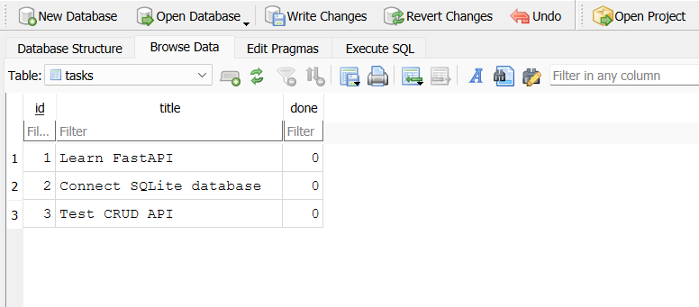
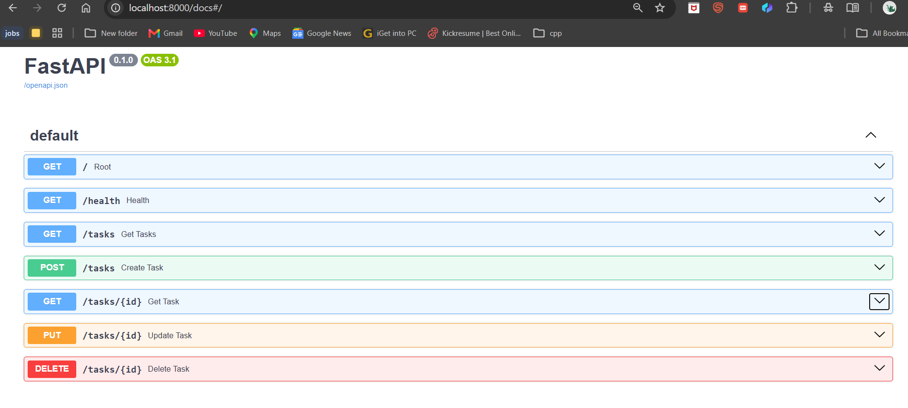

# FlyRank CRUD Task API

A REST API built with Python and FastAPI for managing a to-do task list.

This project was built as part of the **FlyRank Backend Track — Week 3 Assignment 2: Connecting your CRUD to the database**.

The project started as an in-memory CRUD API and was then migrated to **SQLite** while keeping the same API endpoints and behavior.

## Features

* Create tasks
* Read all tasks
* Read a task by ID
* Update tasks
* Delete tasks
* SQLite database persistence
* Automatic database creation
* Automatic `tasks` table creation
* Three example tasks seeded on the first database initialization
* Swagger UI / OpenAPI documentation

## Tech Stack

* Python
* FastAPI
* Uvicorn
* Pydantic
* SQLite
* Python `sqlite3`
* Swagger UI / OpenAPI

## Why SQLite?

SQLite was chosen because it is lightweight and requires no separate database server.

The database is stored in a single file called `tasks.db`. The application automatically creates the database and the `tasks` table when they do not already exist.

SQLite also provides persistence, so tasks remain available after the FastAPI server is stopped and restarted.

The API itself does not change when the storage implementation changes. The same CRUD endpoints continue to work while SQLite acts as the storage layer.

## Database

The SQLite database file is:

```text
tasks.db
```

It is created automatically in the project directory when the application starts.

The database contains a `tasks` table with the following columns:

| Column  | Type    | Description                     |
| ------- | ------- | ------------------------------- |
| `id`    | INTEGER | Primary key generated by SQLite |
| `title` | TEXT    | Task title                      |
| `done`  | BOOLEAN | Task completion status          |

The database file is intentionally **not committed to GitHub**. It is listed in `.gitignore`, allowing each person who clones the repository to generate a fresh database automatically.

## Installation

Clone the repository and enter the project directory:

```bash
cd flyrank-crud-api
```

Create a virtual environment:

```bash
python -m venv venv
```

Windows PowerShell:

```bash
.\venv\Scripts\Activate.ps1
```

Install the dependencies:

```bash
pip install -r requirements.txt
```

## Run the API

Start the server with:

```bash
uvicorn main:app --reload
```

The API will be available at:

```text
http://localhost:8000
```

Swagger UI is available at:

```text
http://localhost:8000/docs
```

The SQLite database `tasks.db` is created automatically when the application starts if it does not already exist.

## API Endpoints

| Method | Endpoint      | Description             | Success |
| ------ | ------------- | ----------------------- | ------- |
| GET    | `/`           | Get API information     | 200     |
| GET    | `/health`     | Check API health        | 200     |
| GET    | `/tasks`      | Get all tasks           | 200     |
| GET    | `/tasks/{id}` | Get a task by ID        | 200     |
| POST   | `/tasks`      | Create a new task       | 201     |
| PUT    | `/tasks/{id}` | Update an existing task | 200     |
| DELETE | `/tasks/{id}` | Delete a task           | 204     |

The API endpoints remain the same as the original CRUD API. Only the storage layer was changed from an in-memory list to SQLite.

## Error Responses

| Status | Meaning                       |
| ------ | ----------------------------- |
| 400    | Invalid or empty request body |
| 404    | Task ID does not exist        |

Example:

```json
{
  "error": "Task 999 not found"
}
```

## Example API Request

Create a task:

```bash
curl.exe -i -X POST http://localhost:8000/tasks ^
  -H "Content-Type: application/json" ^
  -d "{\"title\":\"Learn SQLite\"}"
```

A successful request returns:

```text
HTTP/1.1 201 Created
```

with the newly created task.

Example:

```json
{
  "id": 4,
  "title": "Learn SQLite",
  "done": 0
}
```

Get all tasks:

```bash
curl.exe -i http://localhost:8000/tasks
```

## SQLite Persistence

Tasks are stored in `tasks.db` instead of an in-memory Python list.

For example:

```text
POST /tasks
      ↓
FastAPI
      ↓
SQLite INSERT
      ↓
tasks.db
```

After creating a task, the server can be stopped and restarted. The task remains in the database and can still be retrieved using:

```text
GET /tasks
```

This demonstrates persistence across server restarts.

## SQL Query Example

One of the SQL queries executed during Stage 4 was:

```sql
SELECT * FROM tasks;
```

This query returns all rows and columns from the `tasks` table.

Other SQL queries explored during Stage 4 included:

```sql
SELECT * FROM tasks WHERE done = 1;
```

```sql
SELECT COUNT(*) FROM tasks;
```

```sql
UPDATE tasks SET done = 1;
```

```sql
DELETE FROM tasks WHERE done = 1;
```

These queries were executed directly in DB Browser for SQLite, and the resulting database changes were verified through the FastAPI API.

## Database Screenshot

The SQLite database was opened using **DB Browser for SQLite**.



## Swagger UI

The API includes automatically generated Swagger documentation using FastAPI.

Open Swagger UI at:

```text
http://localhost:8000/docs
```



## Project Structure

```text
flyrank-crud-api/
│
├── main.py
├── requirements.txt
├── README.md
├── .gitignore
└── screenshots/
    ├── swagger-ui.png
    └── database.png
```

The `tasks.db` file is created locally when the application runs and is ignored by Git.

## Stage 4 Database Exploration

The database was manually explored using DB Browser for SQLite.

The following operations were performed:

1. Listed all tasks using `SELECT`.
2. Filtered completed tasks using `WHERE`.
3. Counted tasks using `COUNT()`.
4. Updated tasks using `UPDATE`.
5. Deleted completed tasks using `DELETE`.

The API was then used to verify that changes made directly to the database were immediately reflected by `GET /tasks`.

## Persistence

The completed API now uses SQLite for all CRUD operations:

```text
Client
   ↓
FastAPI API
   ↓
SQLite
   ↓
tasks.db
```

The API endpoints remain unchanged while the storage layer has been replaced with a persistent SQLite database.

This demonstrates that the database is an implementation detail behind the API: clients continue to use the same endpoints while the underlying storage changes from memory to a database.
